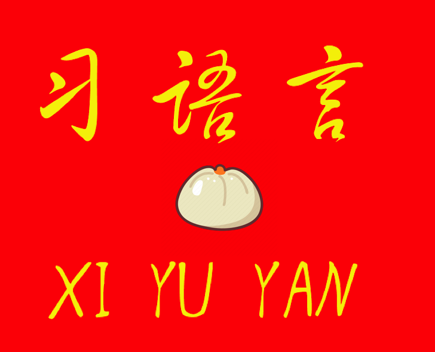

# 习语言 XI YU YAN

<p align="center">
  
</p>


习语言，又称习近平中国特色社会主义互联网编程语言，是一种反映习近平新时代中国特色社会主义思想的新兴语言，有助于经济发展和科技进步，为中华民族伟大复兴中国梦做出贡献。

## 样例

```
我宣布 甲 = 1          注 定义变量甲为 1
我宣布 乙 = 2          注 定义变量乙为 2
我宣布 丙 = 1 + 2      注 定义变量丙为 3
连任 {                   注 无限循环
  回车  丙               注 打印丙 
}
```

## 特色

+ 文化自信

习近平同志在庆祝中国共产党成立95周年大会上，在“三个自信”的基础上加入了“文化自信”，形成了“四个自信”。习语言坚持文化自信作为自己的特色，因此只允许简体中文的标识符和变量名，否则编译将无法通过。

+ 网络强国思想

习近平同志就任以来强调网络安全建设，为了落实网络安全到位，本语言将禁止出现危害祖国和平统一安定的字眼，检查范围包括：

1. 变量名
2. 字符串
3. 整数字面量

例

```
函数 通商宽衣 () {}             注 编译后程序文件被删除
我宣布 我是 = "习" + "近平"      注 运行时报错，因为出现字眼“习近平”
我宣布 屠杀发生于 = 8964         注 编译后程序文件被删除
```

如果权威单位需要使用以上字眼，可以向我司申请密钥，经审批允许使用。

+ 一带一路战略

程序运行时将开启 10 个子进程，它们在主程序运行后不会消失。

+ 偶尔口误

如果变量名大于等于 4 个字，将可能在编译时发生调换以致指代问题。

```
我宣布 金科玉律 = 1;
我宣布 金科律玉 = 2;
回车 金科玉律;         注 有 10% 可能打印 2;
```
